# Introduction

With this paper (?) we wanted to test two major ecological framework that are commonly applied to systems facing repeated perturbations: 

- Critical slowing down (https://www.journals.uchicago.edu/doi/full/10.1086/516845) (https://www.nature.com/articles/nature10723)

- Community rescue (https://www.nature.com/articles/s41559-020-1134-5)

For this we used data coming from an outdoor pond mesocosm experiment (2021 Spain) where a semi-natural phytoplankton community was exposed to three subsequent heatwaves. Heatwaves are becoming more frequent and more intense, rising concerns about whether and how natural communities can face these perturbations and keep performing their functions. Critically, increasing research is suggesting that heatwaves can cause ecological systems to transition.

This transitions, also called tipping points, represent particular points at which complex systems can shift abruptly from one state to another, and they are notoriously difficult to predict.
Attention has thus turned to inferring process from pattern – identifying phenomenological signals in measurable aspect of a biological system that indicates shifts in the under-lying processes that may alter the structure and function of the system. A key development in the search for such pattern-based indicators is early warning signals (EWSs) derived from dynamic systems theory (all Scheffer's papers)

Theory proposes that early warning signals may be based on the phenomenon that recovery rates from perturbations should tend to zero when approaching a tipping point. However, evidence that this happens in living systems is scarce (at best).


Community rescue occurs when ecological or evolutionary processes restore positive growth in a highly stressful environment that was lethal to the community in its ancestral form, thus averting biomass collapse in a deteriorating environment. Very few empirical examples exist about community rescue, yet it is though to be one key mechanism that increases stress resistance in communities and contribute maintaining aggregate community properties such as biomass under stressful conditions.

Here we test whether a semi-natural phytoplankton community undergoing repeated heatwave perturbation shows signs of critical slowing down or community rescue. 

# Material and methods

I just want to mention that I am using only data up to day 38 because I want the same amount of time after each heatwave to compare the recovery after heatwaves. So no longer recovery is assessed and all data points after are likely not going to be used.

# Results
## Water temperature time series

```
## # A tibble: 1 × 1
##   `min(Temp)`
##         <dbl>
## 1        13.1
```

```
## # A tibble: 1 × 1
##   `max(Temp)`
##         <dbl>
## 1        35.7
```

<div class="figure" style="text-align: center">

<p class="caption">(\#fig:temperature_plot)Water temperature dynamics over time.</p>
</div>
The water temperature manipulation using the TENTACLE machinery [https://www.sciencedirect.com/science/article/pii/S2468067222000529] worked quite well. 

## Ecosystem functioning endpoints

### Dissolved oxygen 


Oxygen, again, shows an impaired recovery after the third heatwave. The contrast with the first two heatwave is striking. Indeed, the first two heatwaves determined a decline in DO only while happening, with DO quickly returning to levels higher than the control. The third heatwave strongly decreased DO during its course, and slowed down its recovery in the post HW phase so that it never got back to control levels.
<div class="figure" style="text-align: center">
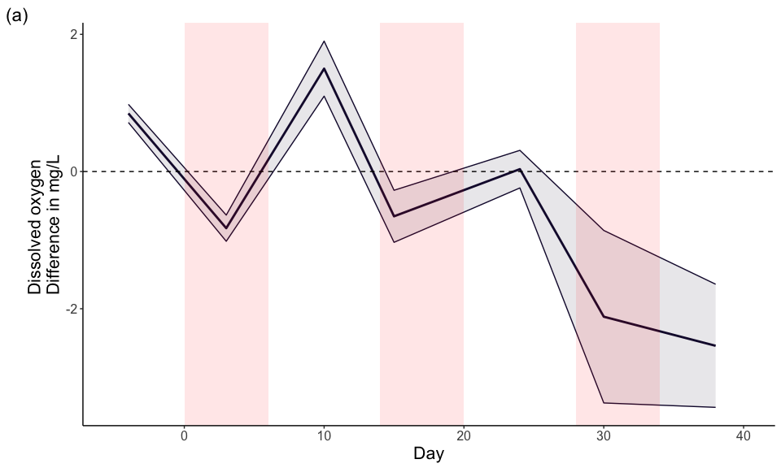
<p class="caption">(\#fig:oxygen_plot)Dissolved oxygen dynamics over time. The red areas show the three heatwaves. The figure shows the difference in DO between mesocosm undergoing the HWs treatment and the control (dashed line at zero).</p>
</div>

We now look specifically at how the slope of recovery changes after each HW. To do that we look at the slope of the linear regression between two subsequent time points (during and after a HW) of the difference between DO in control and HW mesocosms.
<div class="figure" style="text-align: center">
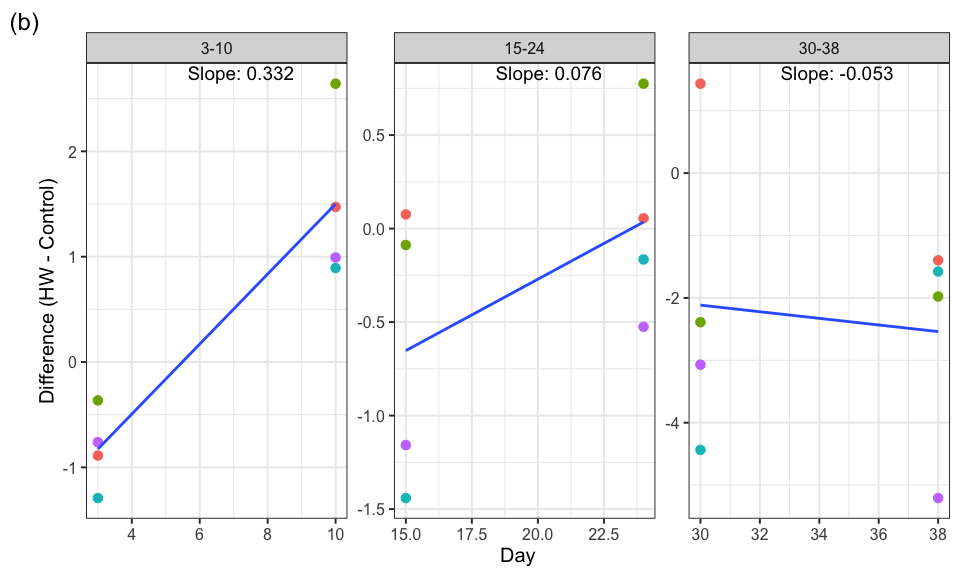
<p class="caption">(\#fig:oxygen_slopes)Change in the slope of the linear regression connecting two subsequent time point ((during and after a HW) of the difference between DO in control and HW mesocosms.</p>
</div>


<div class="figure" style="text-align: center">
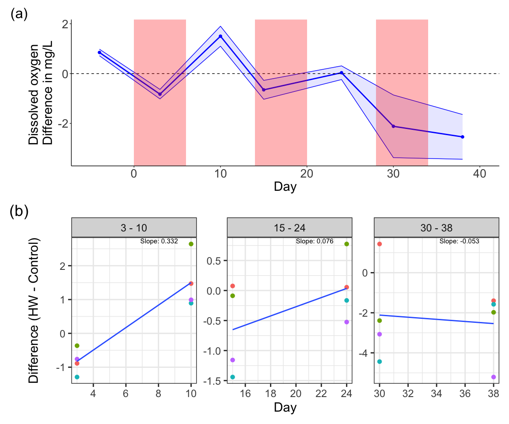
<p class="caption">(\#fig:oxy_combined)combined plot for manuscript</p>
</div>

Creating model for oxygen


Model diagnostics
<div class="figure" style="text-align: center">
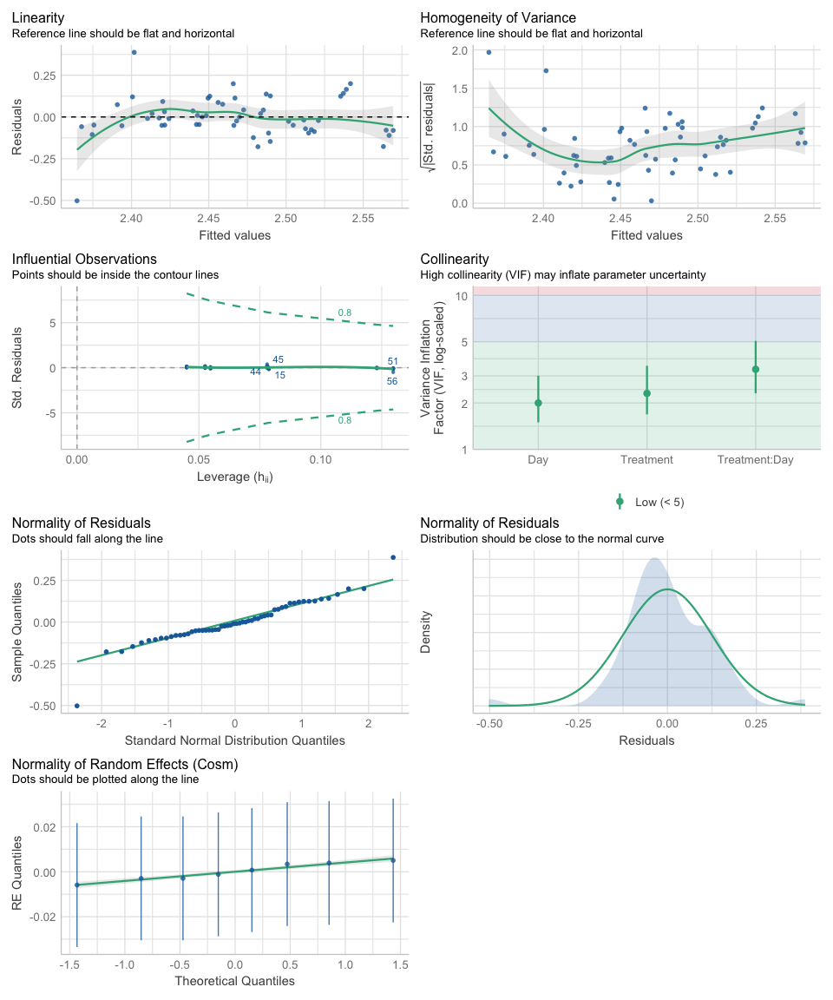
<p class="caption">(\#fig:check_ox_model)Checking assumption for oxygen model</p>
</div>
Not bad.


<table class="table" style="color: black; width: auto !important; margin-left: auto; margin-right: auto;">
 <thead>
  <tr>
   <th style="text-align:left;"> effect </th>
   <th style="text-align:left;"> group </th>
   <th style="text-align:left;"> term </th>
   <th style="text-align:right;"> estimate </th>
   <th style="text-align:right;"> std.error </th>
   <th style="text-align:right;"> statistic </th>
   <th style="text-align:right;"> df </th>
   <th style="text-align:right;"> p.value </th>
  </tr>
 </thead>
<tbody>
  <tr>
   <td style="text-align:left;"> fixed </td>
   <td style="text-align:left;"> NA </td>
   <td style="text-align:left;"> (Intercept) </td>
   <td style="text-align:right;"> 2.435 </td>
   <td style="text-align:right;"> 0.039 </td>
   <td style="text-align:right;"> 62.613 </td>
   <td style="text-align:right;"> 26.146 </td>
   <td style="text-align:right;"> 0.000 </td>
  </tr>
  <tr>
   <td style="text-align:left;"> fixed </td>
   <td style="text-align:left;"> NA </td>
   <td style="text-align:left;"> TreatmentHW </td>
   <td style="text-align:right;"> 0.060 </td>
   <td style="text-align:right;"> 0.055 </td>
   <td style="text-align:right;"> 1.090 </td>
   <td style="text-align:right;"> 26.146 </td>
   <td style="text-align:right;"> 0.286 </td>
  </tr>
  <tr>
   <td style="text-align:left;"> fixed </td>
   <td style="text-align:left;"> NA </td>
   <td style="text-align:left;"> Day </td>
   <td style="text-align:right;"> 0.003 </td>
   <td style="text-align:right;"> 0.002 </td>
   <td style="text-align:right;"> 1.957 </td>
   <td style="text-align:right;"> 46.000 </td>
   <td style="text-align:right;"> 0.056 </td>
  </tr>
  <tr>
   <td style="text-align:left;"> fixed </td>
   <td style="text-align:left;"> NA </td>
   <td style="text-align:left;"> TreatmentHW:Day </td>
   <td style="text-align:right;"> -0.007 </td>
   <td style="text-align:right;"> 0.002 </td>
   <td style="text-align:right;"> -2.689 </td>
   <td style="text-align:right;"> 46.000 </td>
   <td style="text-align:right;"> 0.010 </td>
  </tr>
  <tr>
   <td style="text-align:left;"> ran_pars </td>
   <td style="text-align:left;"> Cosm </td>
   <td style="text-align:left;"> sd__(Intercept) </td>
   <td style="text-align:right;"> 0.015 </td>
   <td style="text-align:right;"> NA </td>
   <td style="text-align:right;"> NA </td>
   <td style="text-align:right;"> NA </td>
   <td style="text-align:right;"> NA </td>
  </tr>
  <tr>
   <td style="text-align:left;"> ran_pars </td>
   <td style="text-align:left;"> Residual </td>
   <td style="text-align:left;"> sd__Observation </td>
   <td style="text-align:right;"> 0.130 </td>
   <td style="text-align:right;"> NA </td>
   <td style="text-align:right;"> NA </td>
   <td style="text-align:right;"> NA </td>
   <td style="text-align:right;"> NA </td>
  </tr>
</tbody>
</table>


Post - hoc analysis. Let see when the HW treatment had a significant impact on phyto abundance
<table class="table" style="color: black; width: auto !important; margin-left: auto; margin-right: auto;">
 <thead>
  <tr>
   <th style="text-align:left;"> contrast </th>
   <th style="text-align:right;"> Day </th>
   <th style="text-align:right;"> estimate </th>
   <th style="text-align:right;"> SE </th>
   <th style="text-align:right;"> df </th>
   <th style="text-align:right;"> t.ratio </th>
   <th style="text-align:right;"> p.value </th>
  </tr>
 </thead>
<tbody>
  <tr>
   <td style="text-align:left;font-weight: bold;"> Control - HW </td>
   <td style="text-align:right;"> -4 </td>
   <td style="text-align:right;"> -0.087 </td>
   <td style="text-align:right;"> 0.063 </td>
   <td style="text-align:right;"> 35.683 </td>
   <td style="text-align:right;"> -1.381 </td>
   <td style="text-align:right;"> 0.176 </td>
  </tr>
  <tr>
   <td style="text-align:left;font-weight: bold;"> Control - HW </td>
   <td style="text-align:right;"> 3 </td>
   <td style="text-align:right;"> -0.040 </td>
   <td style="text-align:right;"> 0.050 </td>
   <td style="text-align:right;"> 19.228 </td>
   <td style="text-align:right;"> -0.802 </td>
   <td style="text-align:right;"> 0.432 </td>
  </tr>
  <tr>
   <td style="text-align:left;font-weight: bold;"> Control - HW </td>
   <td style="text-align:right;"> 10 </td>
   <td style="text-align:right;"> 0.007 </td>
   <td style="text-align:right;"> 0.040 </td>
   <td style="text-align:right;"> 8.677 </td>
   <td style="text-align:right;"> 0.182 </td>
   <td style="text-align:right;"> 0.860 </td>
  </tr>
  <tr>
   <td style="text-align:left;font-weight: bold;"> Control - HW </td>
   <td style="text-align:right;"> 15 </td>
   <td style="text-align:right;"> 0.041 </td>
   <td style="text-align:right;"> 0.036 </td>
   <td style="text-align:right;"> 6.142 </td>
   <td style="text-align:right;"> 1.122 </td>
   <td style="text-align:right;"> 0.304 </td>
  </tr>
  <tr>
   <td style="text-align:left;font-weight: bold;"> Control - HW </td>
   <td style="text-align:right;"> 24 </td>
   <td style="text-align:right;"> 0.101 </td>
   <td style="text-align:right;"> 0.041 </td>
   <td style="text-align:right;"> 9.486 </td>
   <td style="text-align:right;"> 2.490 </td>
   <td style="text-align:right;font-weight: bold;"> 0.033 </td>
  </tr>
  <tr>
   <td style="text-align:left;font-weight: bold;"> Control - HW </td>
   <td style="text-align:right;"> 30 </td>
   <td style="text-align:right;"> 0.142 </td>
   <td style="text-align:right;"> 0.049 </td>
   <td style="text-align:right;"> 18.925 </td>
   <td style="text-align:right;"> 2.869 </td>
   <td style="text-align:right;font-weight: bold;"> 0.010 </td>
  </tr>
  <tr>
   <td style="text-align:left;font-weight: bold;"> Control - HW </td>
   <td style="text-align:right;"> 38 </td>
   <td style="text-align:right;"> 0.195 </td>
   <td style="text-align:right;"> 0.065 </td>
   <td style="text-align:right;"> 37.548 </td>
   <td style="text-align:right;"> 3.023 </td>
   <td style="text-align:right;font-weight: bold;"> 0.004 </td>
  </tr>
</tbody>
</table>


Visualization of model prediction (linear trend)
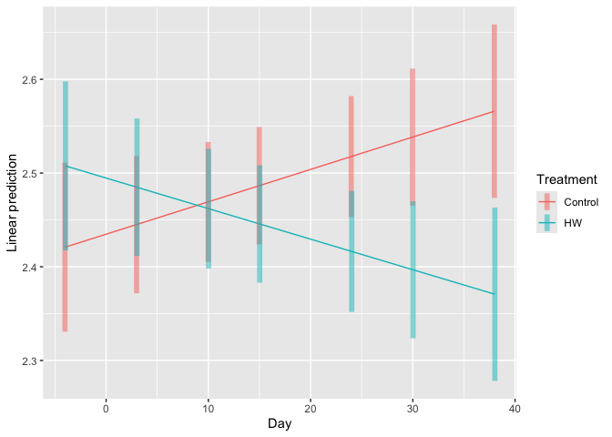<!-- -->

### Chlorophyll - a


Chlorophyll - a shows probably the most dramatic response. There is not much change happening until the third heatwave, which determines a drop in chlorphyll - a. This strong decline reflect the compositional change and especially the reduction in biomass. 

<div class="figure" style="text-align: center">
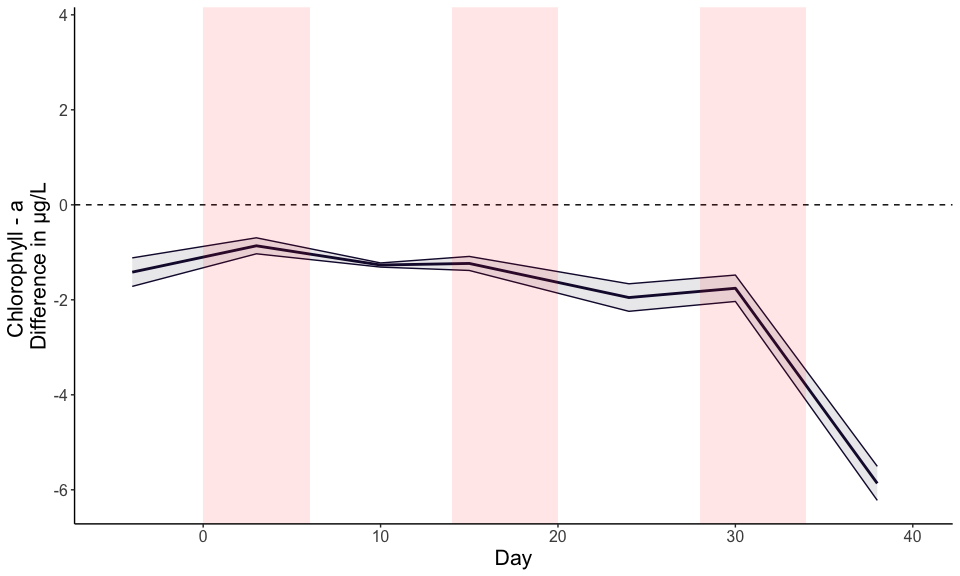
<p class="caption">(\#fig:chlorophyll_plot)CHlorophyll-a dynamics over time. The red areas show the three heatwaves</p>
</div>


We now look specifically at how the slope of recovery changes after each HW. To do that we look at the slope of the linear regression between two subsequent time points (during and after a HW) of the difference between chlorophyll - a concentration in control and HW mesocosms.
<div class="figure" style="text-align: center">
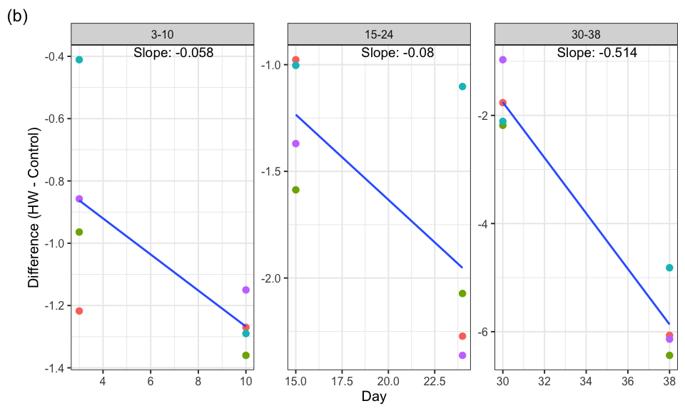
<p class="caption">(\#fig:chla_slopes)Change in the slope of the linear regression connecting two subsequent time point (during and after a HW) of the difference between chlorophyll - a concentration in control and HW mesocosms.</p>
</div>

<div class="figure" style="text-align: center">
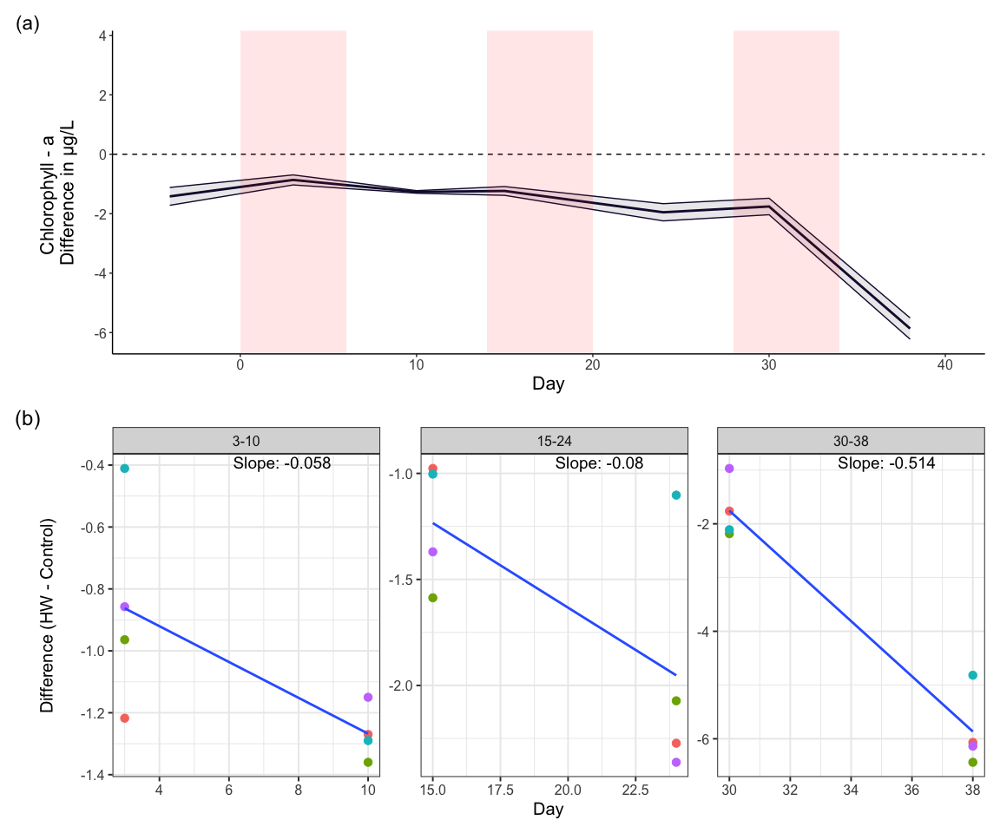
<p class="caption">(\#fig:chla_combined)combined plot for manuscript</p>
</div>

<table class="table" style="color: black; width: auto !important; margin-left: auto; margin-right: auto;">
 <thead>
  <tr>
   <th style="text-align:left;"> effect </th>
   <th style="text-align:left;"> group </th>
   <th style="text-align:left;"> term </th>
   <th style="text-align:right;"> estimate </th>
   <th style="text-align:right;"> std.error </th>
   <th style="text-align:right;"> statistic </th>
   <th style="text-align:right;"> df </th>
   <th style="text-align:right;"> p.value </th>
  </tr>
 </thead>
<tbody>
  <tr>
   <td style="text-align:left;"> fixed </td>
   <td style="text-align:left;"> NA </td>
   <td style="text-align:left;"> (Intercept) </td>
   <td style="text-align:right;"> 0.657 </td>
   <td style="text-align:right;"> 0.214 </td>
   <td style="text-align:right;"> 3.071 </td>
   <td style="text-align:right;"> 25.799 </td>
   <td style="text-align:right;"> 0.005 </td>
  </tr>
  <tr>
   <td style="text-align:left;"> fixed </td>
   <td style="text-align:left;"> NA </td>
   <td style="text-align:left;"> TreatmentHW </td>
   <td style="text-align:right;"> -0.650 </td>
   <td style="text-align:right;"> 0.303 </td>
   <td style="text-align:right;"> -2.148 </td>
   <td style="text-align:right;"> 25.799 </td>
   <td style="text-align:right;"> 0.041 </td>
  </tr>
  <tr>
   <td style="text-align:left;"> fixed </td>
   <td style="text-align:left;"> NA </td>
   <td style="text-align:left;"> Day </td>
   <td style="text-align:right;"> 0.011 </td>
   <td style="text-align:right;"> 0.010 </td>
   <td style="text-align:right;"> 1.108 </td>
   <td style="text-align:right;"> 46.000 </td>
   <td style="text-align:right;"> 0.274 </td>
  </tr>
  <tr>
   <td style="text-align:left;"> fixed </td>
   <td style="text-align:left;"> NA </td>
   <td style="text-align:left;"> TreatmentHW:Day </td>
   <td style="text-align:right;"> -0.020 </td>
   <td style="text-align:right;"> 0.014 </td>
   <td style="text-align:right;"> -1.440 </td>
   <td style="text-align:right;"> 46.000 </td>
   <td style="text-align:right;"> 0.157 </td>
  </tr>
  <tr>
   <td style="text-align:left;"> ran_pars </td>
   <td style="text-align:left;"> Cosm </td>
   <td style="text-align:left;"> sd__(Intercept) </td>
   <td style="text-align:right;"> 0.089 </td>
   <td style="text-align:right;"> NA </td>
   <td style="text-align:right;"> NA </td>
   <td style="text-align:right;"> NA </td>
   <td style="text-align:right;"> NA </td>
  </tr>
  <tr>
   <td style="text-align:left;"> ran_pars </td>
   <td style="text-align:left;"> Residual </td>
   <td style="text-align:left;"> sd__Observation </td>
   <td style="text-align:right;"> 0.711 </td>
   <td style="text-align:right;"> NA </td>
   <td style="text-align:right;"> NA </td>
   <td style="text-align:right;"> NA </td>
   <td style="text-align:right;"> NA </td>
  </tr>
</tbody>
</table>


Model diagnostics
<div class="figure" style="text-align: center">
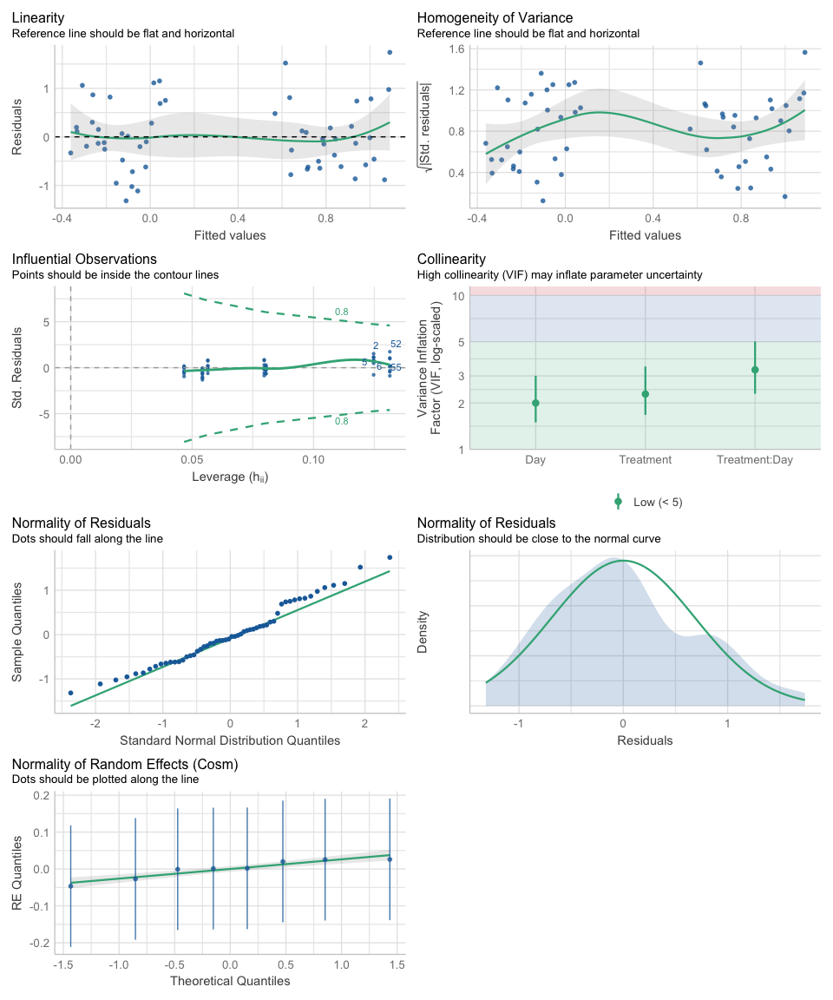
<p class="caption">(\#fig:check_chla_model)Checking assumption for chlorophyll - a model</p>
</div>
Not too bad, but homogeneity of variance a bit messy. Consider transformation.


Post - hoc analysis. Let see when the HW treatment had a significant impact on phyto abundance
<table class="table" style="color: black; width: auto !important; margin-left: auto; margin-right: auto;">
 <thead>
  <tr>
   <th style="text-align:left;"> contrast </th>
   <th style="text-align:right;"> Day </th>
   <th style="text-align:right;"> estimate </th>
   <th style="text-align:right;"> SE </th>
   <th style="text-align:right;"> df </th>
   <th style="text-align:right;"> t.ratio </th>
   <th style="text-align:right;"> p.value </th>
  </tr>
 </thead>
<tbody>
  <tr>
   <td style="text-align:left;font-weight: bold;"> Control - HW </td>
   <td style="text-align:right;"> -4 </td>
   <td style="text-align:right;"> 0.571 </td>
   <td style="text-align:right;"> 0.346 </td>
   <td style="text-align:right;"> 35.284 </td>
   <td style="text-align:right;"> 1.652 </td>
   <td style="text-align:right;"> 0.107 </td>
  </tr>
  <tr>
   <td style="text-align:left;font-weight: bold;"> Control - HW </td>
   <td style="text-align:right;"> 3 </td>
   <td style="text-align:right;"> 0.709 </td>
   <td style="text-align:right;"> 0.273 </td>
   <td style="text-align:right;"> 18.979 </td>
   <td style="text-align:right;"> 2.596 </td>
   <td style="text-align:right;font-weight: bold;"> 0.018 </td>
  </tr>
  <tr>
   <td style="text-align:left;font-weight: bold;"> Control - HW </td>
   <td style="text-align:right;"> 10 </td>
   <td style="text-align:right;"> 0.847 </td>
   <td style="text-align:right;"> 0.219 </td>
   <td style="text-align:right;"> 8.627 </td>
   <td style="text-align:right;"> 3.861 </td>
   <td style="text-align:right;font-weight: bold;"> 0.004 </td>
  </tr>
  <tr>
   <td style="text-align:left;font-weight: bold;"> Control - HW </td>
   <td style="text-align:right;"> 15 </td>
   <td style="text-align:right;"> 0.946 </td>
   <td style="text-align:right;"> 0.201 </td>
   <td style="text-align:right;"> 6.140 </td>
   <td style="text-align:right;"> 4.700 </td>
   <td style="text-align:right;font-weight: bold;"> 0.003 </td>
  </tr>
  <tr>
   <td style="text-align:left;font-weight: bold;"> Control - HW </td>
   <td style="text-align:right;"> 24 </td>
   <td style="text-align:right;"> 1.123 </td>
   <td style="text-align:right;"> 0.225 </td>
   <td style="text-align:right;"> 9.421 </td>
   <td style="text-align:right;"> 5.004 </td>
   <td style="text-align:right;font-weight: bold;"> 0.001 </td>
  </tr>
  <tr>
   <td style="text-align:left;font-weight: bold;"> Control - HW </td>
   <td style="text-align:right;"> 30 </td>
   <td style="text-align:right;"> 1.242 </td>
   <td style="text-align:right;"> 0.272 </td>
   <td style="text-align:right;"> 18.681 </td>
   <td style="text-align:right;"> 4.569 </td>
   <td style="text-align:right;font-weight: bold;"> 0.000 </td>
  </tr>
  <tr>
   <td style="text-align:left;font-weight: bold;"> Control - HW </td>
   <td style="text-align:right;"> 38 </td>
   <td style="text-align:right;"> 1.400 </td>
   <td style="text-align:right;"> 0.355 </td>
   <td style="text-align:right;"> 37.154 </td>
   <td style="text-align:right;"> 3.940 </td>
   <td style="text-align:right;font-weight: bold;"> 0.000 </td>
  </tr>
</tbody>
</table>
As expected from the plot, the estimate increases with time, and there is a big jump from day 31 to 38, corresponding to the drop in chla.


Visualization of model prediction (linear trend)
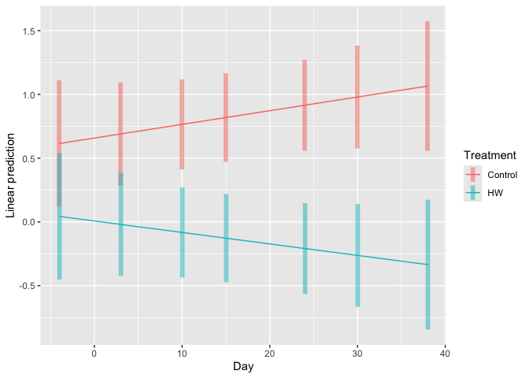<!-- -->


### Relative biomass 
Now we want to see if this gradual decline in oxygen and chla is related to taxonomic differences. 
We start looking at the relative biomass of different phytoplankton group over time


Let's have a look at how different taxonomic groups of phytoplankton change over time in terms of relative biomass 


The relative abundance of different groups changes largely over time, and may align with the drop in ecosystem functioning endpoints. 
<div class="figure" style="text-align: center">
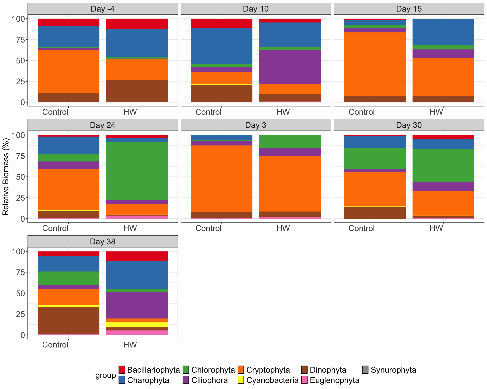
<p class="caption">(\#fig:relative_abundance_plot)Change in relative abundance of phytoplankton groups over time in the control and heatwave treatment</p>
</div>


## Compositional dynamics

we now look if this visual turnover in relative groups biomass is statistically significant

### PERMANOVA


<table class="table" style="color: black; width: auto !important; margin-left: auto; margin-right: auto;">
 <thead>
  <tr>
   <th style="text-align:right;"> Day </th>
   <th style="text-align:right;"> F </th>
   <th style="text-align:right;"> R2 </th>
   <th style="text-align:right;"> p_value </th>
  </tr>
 </thead>
<tbody>
  <tr>
   <td style="text-align:right;"> -4 </td>
   <td style="text-align:right;"> 0.8906189 </td>
   <td style="text-align:right;"> 0.1292509 </td>
   <td style="text-align:right;"> 0.367 </td>
  </tr>
  <tr>
   <td style="text-align:right;"> 3 </td>
   <td style="text-align:right;"> 3.0076513 </td>
   <td style="text-align:right;"> 0.3338996 </td>
   <td style="text-align:right;"> 0.067 </td>
  </tr>
  <tr>
   <td style="text-align:right;"> 10 </td>
   <td style="text-align:right;"> 3.1271167 </td>
   <td style="text-align:right;"> 0.3426182 </td>
   <td style="text-align:right;font-weight: bold;"> 0.027 </td>
  </tr>
  <tr>
   <td style="text-align:right;"> 15 </td>
   <td style="text-align:right;"> 1.6979076 </td>
   <td style="text-align:right;"> 0.2205674 </td>
   <td style="text-align:right;"> 0.129 </td>
  </tr>
  <tr>
   <td style="text-align:right;"> 24 </td>
   <td style="text-align:right;"> 0.7369494 </td>
   <td style="text-align:right;"> 0.1093892 </td>
   <td style="text-align:right;"> 0.691 </td>
  </tr>
  <tr>
   <td style="text-align:right;"> 30 </td>
   <td style="text-align:right;"> 3.0654494 </td>
   <td style="text-align:right;"> 0.3381464 </td>
   <td style="text-align:right;font-weight: bold;"> 0.032 </td>
  </tr>
  <tr>
   <td style="text-align:right;"> 38 </td>
   <td style="text-align:right;"> 2.4293108 </td>
   <td style="text-align:right;"> 0.2881980 </td>
   <td style="text-align:right;font-weight: bold;"> 0.026 </td>
  </tr>
</tbody>
</table>

Significant differences on day 2, 10, 30, and 38


NMDS plot
Not sure if this makes sense, as the change in relative biomass plot looks much nicer
<div class="figure" style="text-align: center">
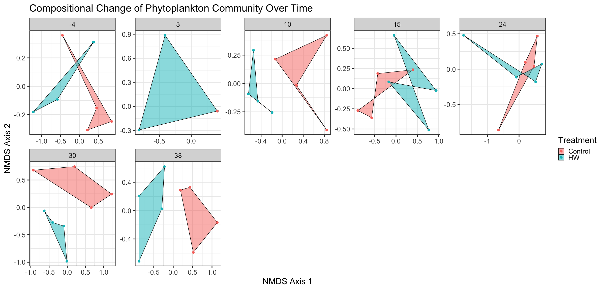
<p class="caption">(\#fig:composition_plot_NMDS)Non-Metric Multidimensional Scaling plot of compositional dynamics over time.</p>
</div>


# Discussion 

This is just a preliminary check to see if there is enough interesting material for a paper. 
Statistics look ok.


Considering the small amount of experimental units, I am not sure how big we can go with this. 
Yet, there are at least two things to consider:
- heatwave are still a very hot topic (see continous literature being publish on HW)
- Community rescue, but particualrly critical slowing down are very fancy theory to test. Critical slowing down is closely related to the whole regime shift / critical transition theory, thus linking it up with the growing concer of heatwaves, and particulalry recurring heatwaves could put us in a nice position. 
